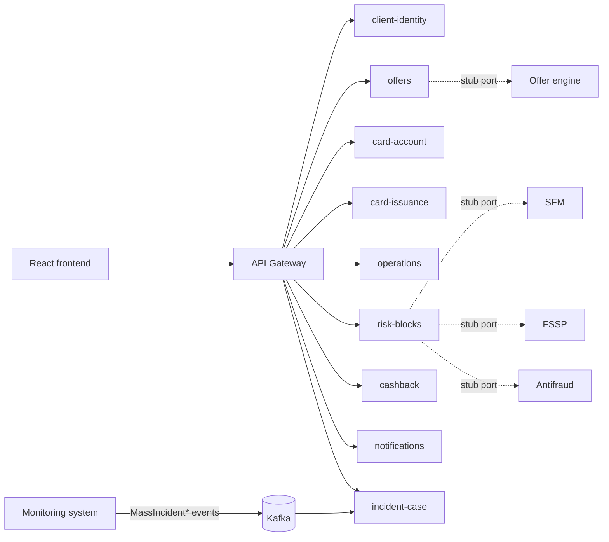
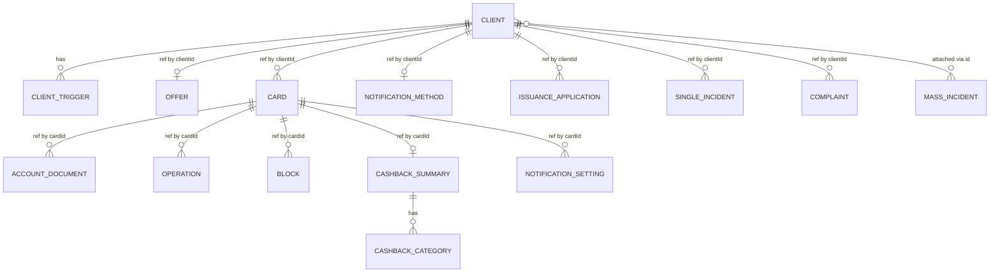
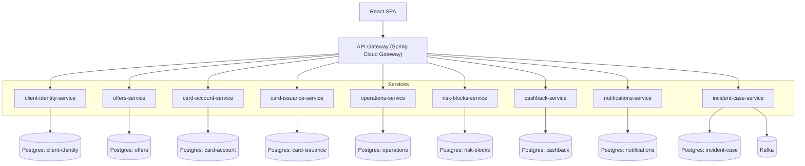

# Architecture Spine — mts-client-card-office backend

## Design Paradigm

Domain-Driven Design: nine bounded contexts, each its own deployable Spring Boot microservice, each internally structured hexagonally (ports-and-adapters). No shared kernel, no shared database.

Per-service package layout (base package `ru.mtsbank.cardoffice.<service>`):

- `domain/` — entities, value objects, domain services, and **ports** (interfaces the domain depends on: repository ports, external-system ports)
- `application/` — use cases / application services that orchestrate domain objects through ports; this is the only layer that talks to more than one domain object at a time
- `adapters/in/web/` — REST controllers implementing the resource shape in AD-8; translate HTTP ⇄ application-layer calls only, no business logic
- `adapters/in/messaging/` — Kafka consumers (incident-case-service only today; see AD-5)
- `adapters/out/persistence/` — JPA repositories implementing domain repository ports against the service's own PostgreSQL schema
- `adapters/out/external/` — stub adapters implementing external-system ports (SFM/FSSP/antifraud, offer engine); the only place a later real integration touches (AD-10)

## Invariants & Rules

### AD-1 — Service boundaries are fixed at nine bounded contexts, DB-per-service

- **Binds:** all
- **Prevents:** a new capability being bolted onto the nearest existing service instead of routed to its owning context; two services independently claiming the same data; shared-schema coupling that defeats independent deployability
- **Rule:** exactly these nine services exist, each with its own PostgreSQL database/schema (no shared tables, no shared schema, no cross-service joins):
  - `client-identity` — client profile, badges, triggers, open-case reference links
  - `offers` — top bank offer(s) for a client; a facade over a stub port to the bank's external offer/marketing engine (same pattern as `risk-blocks`, see AD-10)
  - `card-account` — cards, balances, linked account, account statement documents
  - `card-issuance` — new-card/reissue applications and issuance history
  - `operations` — per-card transaction history and failed-transfer alerts
  - `risk-blocks` — SFM / ФССП arrest / antifraud block status; a facade over stub adapters for those three external systems
  - `cashback` — accumulated cashback, category rates, promotional offers
  - `notifications` — per-card notification-channel toggles and the client's primary contact method (ОМТ — "Основной метод связи с клиентом", per `kbStubs.omt` in `mockData.js`)
  - `incident-case` — mass incidents (Kafka-consumed), single incidents, complaints, and client-to-mass-incident attachment links
  A capability that doesn't fit one of these owners requires a new AD-1 entry (a tenth service), never a silent extension of a neighboring service's scope. (`offers` was itself added this way — `getOffer` did not fit `client-identity` cleanly, so it became its own context rather than an extension.)

### AD-2 — Cross-context references are by ID only

- **Binds:** all
- **Prevents:** two services drifting on a copy of the same fact (e.g. client name cached in two places going stale)
- **Rule:** a service referencing another context's entity stores only its ID (`clientId`, `cardId`, `incidentId`, …), never a denormalized copy of that entity's fields. Consumers needing the full entity fetch it live through the Gateway.

### AD-3 — Money is an integer in minor units, never a formatted string

- **Binds:** `card-account`, `operations`, `cashback`, `risk-blocks` (arrest sum), any service returning a monetary amount
- **Prevents:** currency/locale formatting logic leaking into the backend and diverging from the frontend's own formatting; parse-the-string bugs
- **Rule:** every monetary field is a signed integer in kopecks (minor units) — never a string with a currency symbol, thousands separator, or sign glyph. Presentation formatting is exclusively a frontend concern.

### AD-4 — Link fields must be relative-internal only `[ADOPTED]`

- **Binds:** `client-identity` (trigger `link` field), and any future field carrying a link/URL from any service
- **Prevents:** a compromised or careless service handing the frontend an absolute/external/protocol-relative URL that `<Link>` would navigate to, reopening GHSA-wrjc-x8rr-h8h6 (the frontend's `IdentityBar.isSafeInternalLink` already enforces `^/(?!/|\\)` client-side, but the backend must not rely on that as the only guard)
- **Rule:** any response field that is a link/URL must be a path matching `^/(?!/|\\)` — relative, internal, never starting with `//`, `\`, or a scheme (`http:`, `javascript:`, …). A service that cannot express a target this way must send `null`, never an absolute URL.

### AD-5 — Mass incidents arrive as Kafka events, never polling

- **Binds:** `incident-case`
- **Prevents:** `incident-case-service` (or any other service) polling the monitoring system, and the divergence that would create between "when an incident opened" and "when we noticed"
- **Rule:** the monitoring system publishes `MassIncidentOpened` / `MassIncidentUpdated` / `MassIncidentClosed` events to Kafka; `incident-case-service` is the sole consumer and the system of record for mass-incident state. No other service reads mass-incident state directly from the monitoring system.

### AD-6 — API Gateway is the single frontend entry point

- **Binds:** all
- **Prevents:** the frontend (or any client) calling a service directly, which would fragment the base-URL/auth contract `fetchJson` currently assumes is singular
- **Rule:** Spring Cloud Gateway is the only ingress the frontend talks to; the frontend's base URL points at the Gateway only. Services are not reachable from the frontend's network directly (in the demo docker-compose, only the Gateway publishes a host port).

### AD-7 — Auth is a Gateway-issued trusted header (demo stub)

- **Binds:** all
- **Prevents:** nine services independently inventing nine different ways to check "who is this employee" for the demo
- **Rule:** the Gateway authenticates (stub) and forwards the employee identity as a trusted header (e.g. `X-Employee-Id`); every service trusts that header without re-authenticating. Because AD-6 keeps services unreachable except through the Gateway, no service-side signature check on the header is required for the demo — that hardening (and the header's replacement) is Deferred to the real OAuth2/OIDC integration.

### AD-8 — REST/HTTP resource shape mirrors the existing frontend contract `[ADOPTED]`

- **Binds:** `client-identity`, `offers`, `card-account`, `card-issuance`, `operations`, `risk-blocks`, `cashback`, `notifications`, `incident-case`
- **Prevents:** each service inventing its own endpoint/verb conventions that would force the Gateway to translate rather than route
- **Rule:** resource paths mirror `src/api/client.js`'s existing shape — `/clients/{id}`, `/clients/{id}/offers/top`, `/clients/{id}/products/{productId}/cards`, `/cards/{cardId}/operations`, `/cards/{cardId}/blocks`, `/cards/{cardId}/cashback`, `/clients/{id}/incidents/single`, `/incidents/mass`, etc. GET for reads; POST for actions/mutations (attach, create, toggle, send, print); JSON request/response bodies.

### AD-9 — Services never call each other synchronously

- **Binds:** all
- **Prevents:** a hidden service-to-service HTTP dependency chain turning nine independently-deployable services into a distributed monolith
- **Rule:** no service issues an HTTP call to another service. Aggregation across contexts happens either as multiple independent Gateway-routed calls (the frontend already calls each concern separately — `getClientCard`, `getCards`, `getOperations`, etc. — so no service-side aggregation is needed today) or, for state that must react to another context's events, via Kafka (AD-5, AD-11). See the dependency-direction diagram below — it is the enforceable form of this rule.



No edges exist between the nine service boxes above — that absence is the rule, not an omission.

### AD-10 — External systems sit behind a stub port, not inline in domain logic

- **Binds:** `risk-blocks` (SFM, FSSP, antifraud), `offers` (the bank's external offer/marketing engine)
- **Prevents:** stub fixture logic getting welded into a service's domain/application code, which would make the later swap to a real external protocol a rewrite instead of a plug-in
- **Rule:** each service defines one port interface per external system it fronts (`risk-blocks-service`: `SfmPort`, `FsspPort`, `AntifraudPort`; `offers-service`: `OfferEnginePort`) in its domain/application layer; the demo binds each to a stub adapter in `adapters/out/external/` returning fixture data. Swapping in a real integration adds a new adapter implementation only — domain and application code must not change.

### AD-11 — Kafka event contract: topic naming and envelope

- **Binds:** `incident-case` (consumer), the monitoring system (external producer)
- **Prevents:** the producer and consumer sides being built against incompatible topic names or payload shapes with no way to detect the mismatch until integration
- **Rule:** topics are named `<bounded-context>.<entity>.<event-verb>` in dot-case (e.g. `incident-case.mass-incident.opened`, `.updated`, `.closed`). Every event payload is JSON with the envelope `{ "eventId": string, "eventType": string, "occurredAt": ISO-8601, "version": integer, "data": {...} }`. `incident-case-service` must ignore unknown fields inside `data` (forward-compatible) and route events carrying an unsupported `version` to a dead-letter topic rather than fail silently.

## Consistency Conventions

| Concern | Convention |
| --- | --- |
| Naming (entities, files, interfaces, events) | Java packages `ru.mtsbank.cardoffice.<service>.{domain,application,adapters}`; REST resources plural nouns mirroring `src/api/client.js` (AD-8); Kafka topics `<bounded-context>.<entity>.<event-verb>` in dot-case (AD-11) |
| Data & formats (ids, dates, error shapes, envelopes) | IDs are opaque strings; each service keeps the per-entity-type prefix already visible in the mock contract (`card-`, `MI-`, `ЕИ-`, `doc-`, `req-`, `complaint-`) so IDs stay visually distinguishable when they appear together (e.g. in `incident-case`'s client-attachment links) — the exact generation scheme (UUID vs. sequence) is each service's own choice. Money: signed integer minor units, never formatted (AD-3). Timestamps/dates on the wire: ISO-8601 UTC; locale/format presentation ("12.09.2026") is a frontend concern, by the same rationale as AD-3. Error envelope: `{ "error": { "code": string, "message": string, "details"?: object } }`, with HTTP status carrying the error class (4xx client, 5xx server) — uniform across all nine services |
| State & cross-cutting (mutation, errors, logging, config, auth) | Auth: Gateway forwards employee identity via `X-Employee-Id` trusted header (AD-7); mutations are POST, returning at minimum `{ ok: true }` today and additive-only going forward (client.js already documents real handlers will add a created-entity id); cross-context references are ID-only (AD-2); logs include the employee-id header and any cross-referenced entity ID for traceability; testing: each service's integration tests run against its own Testcontainers instances (Postgres, plus Kafka for `incident-case-service`) — never a shared or cross-service test database, consistent with AD-1's DB-per-service |

## Stack

| Name | Version |
| --- | --- |
| Java | 25 LTS |
| Spring Boot | 4.1.1 |
| PostgreSQL | 18.6 |
| Apache Kafka | 4.3.1 |
| Maven | 3.9.16 |
| Testcontainers (Java) | 2.0.5 |

## Structural Seed

Lives at `backend/` inside the existing frontend repo (`EFS`), as a Maven multi-module tree sitting alongside `src/` — one git repository for frontend and backend, not the separate monorepo originally decided (superseded during Story 0 setup, see memlog).

```text
backend/
  pom.xml                          # parent aggregator POM (Maven multi-module)
  docker-compose.yml               # gateway + 9 services + Kafka + one Postgres per service
  gateway/
    src/main/java/ru/mtsbank/cardoffice/gateway/
  client-identity-service/
    src/main/java/ru/mtsbank/cardoffice/clientidentity/
      domain/                      # entities, value objects, ports
      application/                 # use cases
      adapters/in/web/             # REST controllers (AD-8)
      adapters/out/persistence/    # JPA repositories implementing domain ports
    src/test/java/...              # Testcontainers integration tests (Postgres)
  offers-service/                  # same internal shape, plus adapters/out/external/offer-engine/ stub adapter (AD-10)
  card-account-service/            # same internal shape
  card-issuance-service/           # same internal shape
  operations-service/              # same internal shape
  risk-blocks-service/             # same internal shape, plus adapters/out/external/{sfm,fssp,antifraud}/ stub adapters (AD-10)
  cashback-service/                # same internal shape
  notifications-service/           # same internal shape
  incident-case-service/           # same internal shape, plus adapters/in/messaging/ Kafka consumer (AD-5, AD-11)
                                    # + Testcontainers Kafka module in its integration tests
```

Core entities per service, derived from `mockData.js` shapes — names and relationships only; cross-service links are ID references (AD-2), never shared tables:



`CLIENT`, `CLIENT_TRIGGER` live in `client-identity`; `OFFER` in its own `offers` service (AD-1, AD-10); `CARD`, `ACCOUNT_DOCUMENT` in `card-account`; `ISSUANCE_APPLICATION` in `card-issuance`; `OPERATION` in `operations`; `BLOCK` in `risk-blocks`; `CASHBACK_SUMMARY`/`CASHBACK_CATEGORY` in `cashback`; `NOTIFICATION_SETTING`/`NOTIFICATION_METHOD` in `notifications`; `SINGLE_INCIDENT`/`COMPLAINT`/`MASS_INCIDENT` in `incident-case`.



## Deferred

- **Employee role/session model (КЦ / Чат / Офис).** The frontend implements only the Office role today; role determination (session field, AD group, separate URL) is unresolved (README open question 1). Revisit once a second role's frontend shell exists.
- **Production auth: OAuth2/OIDC via corporate SSO.** The demo's `X-Employee-Id` trusted-header stub (AD-7) is explicitly temporary; this is its named replacement, not built now. Revisit when this track leaves demo status.
- **Production deployment/environment envelope** — cloud provider, Kubernetes, CI/CD, environment promotion. The demo scope needs only local `docker-compose` (gateway + 9 services + Kafka + per-service Postgres, per the container diagram above). Revisit once this becomes a real production track.
- **Real SFM/FSSP/antifraud/offer-engine/monitoring integration protocols.** All are stub adapters/fixtures for the demo; AD-10 keeps each swap-in point clean but the actual protocols (REST? SOAP? file batch?) are unresolved and out of scope until this stops being a demo.
- **Tablet-responsive layout.** Confirmed by the user as a frontend/design-kit concern (a separate Granat 2.0 responsive-layout track), not a backend concern — API contracts are device-agnostic regardless of layout.
- **UI-kit/design-system sourcing** (README open question 2 — whether МТС Банк has an internal Storybook/npm package). Purely a frontend/design concern; it does not bind anything in this backend spine and is noted here only for completeness, not as a backend deferral.

